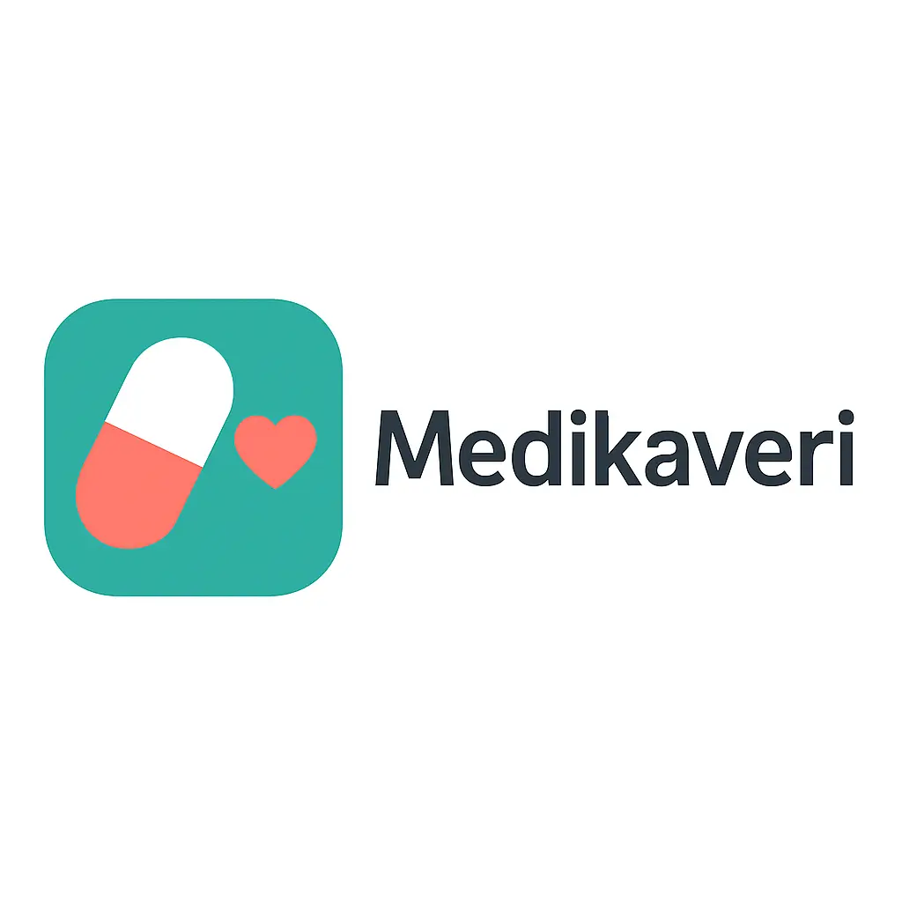

# Medikaveri – Lääkemuistuttaja (MVP)



_Versio: 0.1.0 (MVP-kehitysvaihe)_

Medikaveri on yksinkertainen ja selkeä lääkemuistuttaja, joka ei vaadi kirjautumista.
Kaikki tiedot tallennetaan paikallisesti käyttäjän laitteelle, joten sovellus toimii myös offline-tilassa.

## 🎯 Tavoite

- Helpottaa ihmisille lääkkeiden ottamista ajallaan
- Tarjota mahdollisimman yksinkertainen ja helppokäyttöinen käyttöliittymä
- Ei käyttäjätiliä, ei pilvitallennusta – kaikki pysyy käyttäjän omassa laitteessa
- Harrasteprojekti, jota kehitetään ajan kanssa
- Tavoitteena julkaista sovellus Android- ja iOS-laitteille

## ✨ Ominaisuudet (MVP)

- Lääkkeen lisääminen:
  - nimi
  - kellonaika
  - toisto: joka päivä
- Lääkkeiden lista etusivulla
- Paikalliset ajastetut ilmoitukset (notifikaatiot)
- "Merkitse otetuksi" -toiminto kullekin päivälle
- Tiedot tallennetaan paikallisesti (esim. AsyncStorage / SecureStore)
- Asetukset:
  - ääni/värinä päälle/pois
  - kaikkien tietojen tyhjennys

## 🧭 Näkymät

### 1. Etusivu – **Lääkkeeni**

- Lista kaikista lisätyistä lääkkeistä
- Indikaattori, onko tämän päivän annos merkitty otetuksi
- Painikkeet:
  - **Lisää lääke**
  - **Asetukset**

### 2. Lääkkeen lisäys

- Kentät:
  - Lääkkeen nimi
  - Kellonaika (TimePicker)
  - Toisto: *joka päivä* (MVP-vaiheessa)
- **Tallenna**-painike, joka:
  - tallentaa tiedot
  - luo ajastetun notifikaation

### 3. Asetukset

- Äänet / värinä:
  - kytkin päälle/pois
- **Tyhjennä kaikki tiedot** -painike, joka poistaa:
  - lääkkeet
  - notifikaatiot
  - mahdolliset paikalliset tilatiedot

## 🗄️ Datamalli (esimerkki)

```json
[
  {
    "id": "abc123",
    "name": "Panadol 500 mg",
    "time": "10:00",
    "repeat": "daily",
    "lastTaken": "2025-11-24T10:03:00.000Z",
    "notificationId": "12345"
  }
]
```

Tämä on esimerkkirakenne siitä, miten lääkeitä voidaan tallentaa sovelluksen tilaan ja paikalliseen tallennukseen.

## 🛠️ Teknologiat

- React Native
- Expo-projekti
- Paikallinen tallennus:
  - `@react-native-async-storage/async-storage` **tai** `expo-secure-store`
- Paikalliset ilmoitukset:
  - esim. `expo-notifications` (tai muu vastaava kirjasto)

## 🔔 Notifikaatiot

- Käyttäjältä pyydetään lupa ilmoituksiin ensimmäisellä käynnistyskerralla
- Jokaiselle lääkkeelle luodaan ajastettu notifikaatio valittuun kellonaikaan
- Ilmoituksen viesti:  
  `Aika ottaa [lääkkeen nimi]`

## 📈 Jatkokehitysideoita

MVP:n jälkeen mahdollisia jatkokehityksiä:

- Useampi kellonaika per lääke
- Viikkokohtaiset annospäivät (esim. ma–pe, vain tietyt päivät)
- Historia ja graafit lääkkeenottojen seurannasta
- Omaishoitajan tila / tiedon jakaminen toiselle henkilölle

## ⚠️ Vastuuvapauslauseke

Medikaveri on harrasteprojektina kehitetty sovellus eikä se ole lääkinnällinen laite tai virallinen terveydenhuollon järjestelmä.

- Sovellus **ei korvaa lääkärin, hoitajan tai apteekin antamia ohjeita**.
- Käyttäjä vastaa itse lääkehoitonsa oikeellisuudesta, aikatauluista ja annostuksesta.
- Jos olet epävarma lääkityksestäsi tai voinnistasi, ota aina yhteys terveydenhuollon ammattilaiseen.
- Kehittäjä ei vastaa mahdollisista vahingoista, jotka johtuvat sovelluksen käytöstä tai sen virheellisestä käytöstä.

## 📄 Lisenssi

```text
MIT License

Copyright (c) 2025 Sasa Mora Roca

Permission is hereby granted, free of charge, to any person obtaining a copy
of this software and associated documentation files (the "Software"), to deal
in the Software without restriction, including without limitation the rights
to use, copy, modify, merge, publish, distribute, sublicense, and/or sell
copies of the Software, and to permit persons to whom the Software is
furnished to do so, subject to the following conditions:

The above copyright notice and this permission notice shall be included in all
copies or substantial portions of the Software.

THE SOFTWARE IS PROVIDED "AS IS", WITHOUT WARRANTY OF ANY KIND, EXPRESS OR
IMPLIED, INCLUDING BUT NOT LIMITED TO THE WARRANTIES OF MERCHANTABILITY,
FITNESS FOR A PARTICULAR PURPOSE AND NONINFRINGEMENT. IN NO EVENT SHALL THE
AUTHORS OR COPYRIGHT HOLDERS BE LIABLE FOR ANY CLAIM, DAMAGES OR OTHER
LIABILITY, WHETHER IN AN ACTION OF CONTRACT, TORT OR OTHERWISE, ARISING FROM,
OUT OF OR IN CONNECTION WITH THE SOFTWARE OR THE USE OR OTHER DEALINGS IN THE
SOFTWARE.
```
